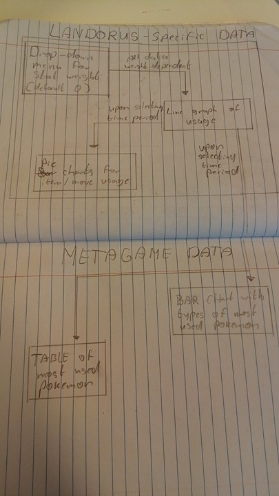

# Final programming project

Casper van Velzen
11030275

# Data sources

Almost all of the used stats can be found on http://www.smogon.com/stats/
I have transformed all data about Landorus into four different json files, depending on how the data is weighed (low ranked players have less influence).
The stats can be accessed via an index for the month (0-11) usage_stats, items or moves.

Data about the metagame (the other Pokemon) will be stored in a similar fashion, however I'll only store information about usage percentage, types and wheter Landorus has a generally good, bad or neutral matchup.

In order to explain some data, I will most likely use data from https://www.pokemon.com/us/play-pokemon/worlds/2015/teams/masters/ (the top 8 teams in the World Championships all had Landorus). However, this data is not used in any visualisations

# Diagram

# Description of each component

## Dropdown menu

This influences what data set gets used. Since all data sets are formatted the same way, this shouldn't give any problems with the visualisations. The four options in the menu are 0, 1500, 1630 and 1760 and default to 0 upon loading the page.
A dropdown menu can be made using html.

## Line graph

This line shows Landorus' usage in percents over a one year period. Stats from Lando_data_x.json are used depending on the weight selected in the dropdown menu. The x axis shows time (jan 2015 to dec 2015) and the y axis shows usage percentage.
Optional: a red line shows when the World Championships happened.
No other libraries than the standard d3 library are needed for this feature.

## Pie charts

These two charts show what items and moves are most common on Landorus. The data used is dependant on the selected weight and month. Mouseover highlights name and usage percentage in the table below it (like done in https://3ds.pokemon-gl.com/battle/usum/).
Optional: Toopltip with description of the item/move on click.
d3tip is needed for these charts.

## Bar chart

Data is picked once again based on weight and month. This chart gives a quick rough estimate of the most used Pokemon and their typing, relating it to their matchups against Landorus-T by way of colour (for example, Ice would be red, since Landorus takes 4x damage from ice type attacks, and electric would be green since Landorus is immune to electric and hits back super effectively with its ground type moves).
The types are counted with a quick algoritm that iterates of the top pokemon data and increments a counter for every type whenever the type is listed.
No other libraries than the standard d3 library are needed for this feature.

## Table

The same dataset is used as for the bar chart. Based on weight and month a top 20 most used pokemon is represented in a table, sorted based on usage. Additional info in the chart: usage percentage (new column), good/bad/neutral matchup for Landorus (row colour), optional: On click on name link to Smogon analysis (battle spot doubles, since there's no vgc15 analysis, but it's the same format. Smogon links are consistent).
No other libraries than the standard d3 library are needed for this feature, but I don't know how to put in links yet, so I might need something else for that.

# List of d3 plugins

- d3tip
- maybe something that helps with hyperlinks