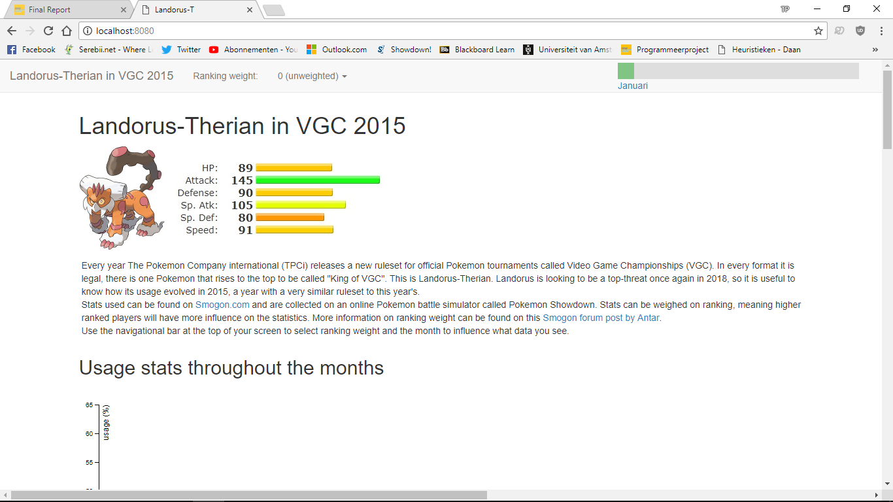
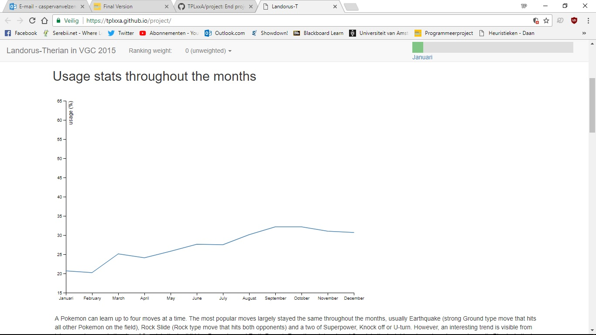
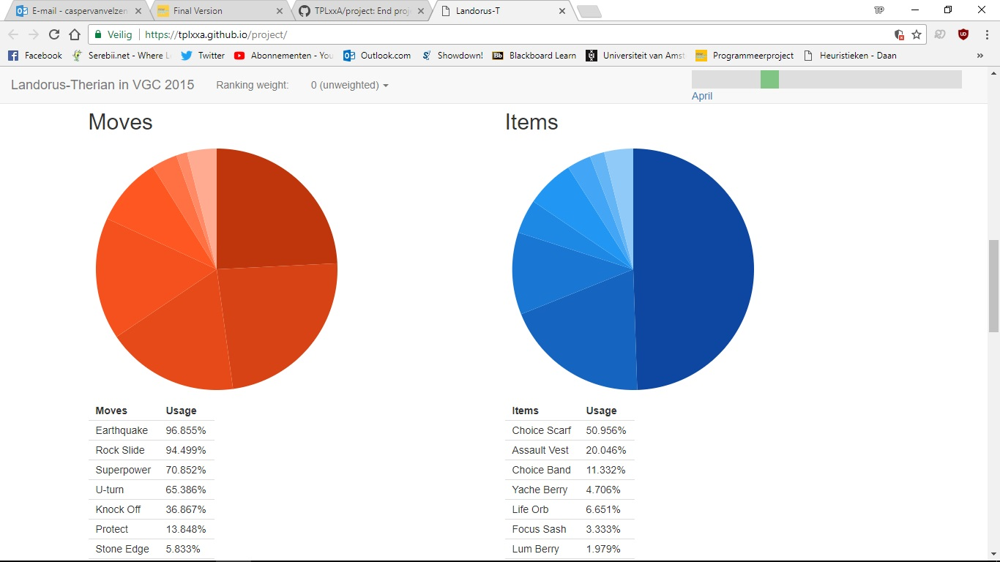
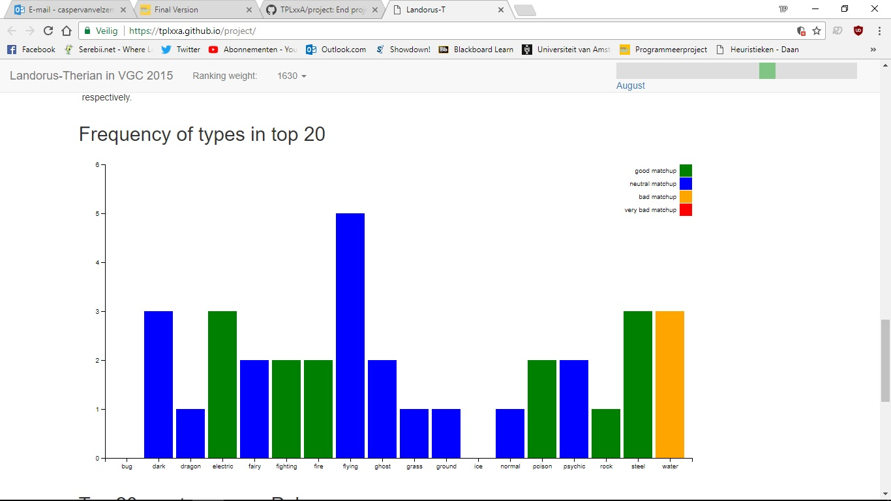
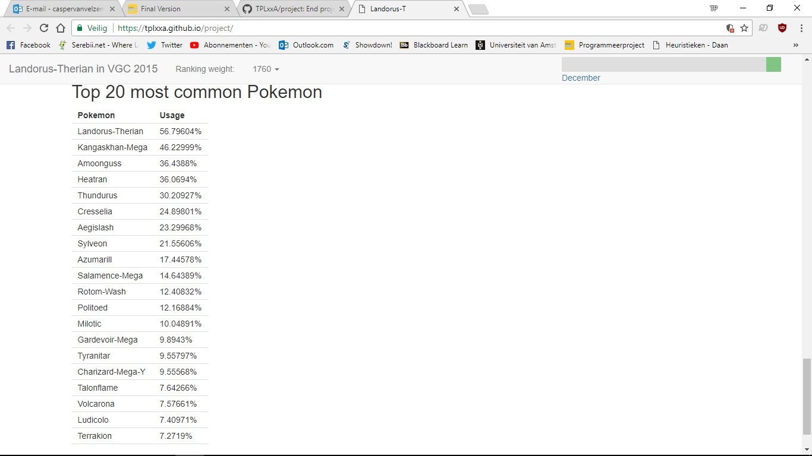

# Final programming project

Casper van Velzen
11030275

# Github pages

https://tplxxa.github.io/project/

# Problem statement

Every year The Pokemon Company international (TPCi) release a new ruleset for official Pokemon tournaments called Video Game Championships (VGC). In every format it is legal (and absurdly stong Pokemon are banned), there is one Pokemon that rises to the top to be called "King of VGC". This is Landorus-Therian. I aim to visualise its usage in the 2015 format, since it is most similar to the 2018 format, in which Landorus-T promises to be very strong again. This is useful for Pokemon players who want to study how a metagame evolves to be able to make a better metagame call for the World Championships this year.

# Screenshots

# Copyright

All copyright belongs to the creator of this repository. Use of this repository's contents is permitted, but only with proper documentation of the source. See LICENCE.md for more details.