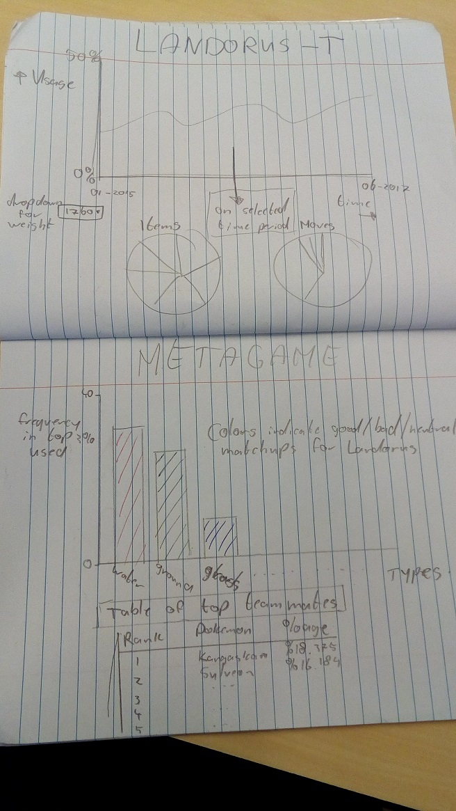

# Final programming project

## Casper van Velzen
## 11030275

# Problem statement

Every year The Pokemon Company international (TPCi) release a new ruleset for official Pokemon tournaments called Video Game Championships (VGC). In every format it is legal (and absurdly stong Pokemon are banned), there is one Pokemon that rises to the top to be called "King of VGC". This is Landorus-Therian. I aim to visualise its usage in the 2015 format, since it is most similar to the 2018 format, in which Landorus-T promises to be very strong again.

# Solution

## Summary

Visualisations for usage frequency, item and move choice and metagame trends (what other type of Pokemon are common) do not exist yet.

## Visual sketch

## Main features

### Minimum viable products

- Line graph showing percentage of usage from jan 2015 to jun 2017 (the period in which vgc2015 was playable on Pokemon battle simulator Pokemon Showdown).
- Pie charts showing item and move usage in selected time period
- Bar chart of the types of Pokemon with 3% or more usage in the selected time period. Colours indicating good or bad matchups for Landorus-T
- Dropdown menu to select wheter or not and how data should be weighted (higher ranked players get more influence in the data)
- Table of top 10 teammates or top something (50?) most used Pokemon

### Random additions

- Mouseover that shows usage stats, like real value and rank (i.e. #1 most used).
- Make pokemon names in table clickable, so that it takes the user to the Smogon analysis for more info

# Prerequisites

## Data sources

The stats were collected by Antar (https://twitter.com/InfiniteAntar) and are available at http://www.smogon.com/stats/

## External components

I'm not sure wheter I need any libraries that we haven't already used. I'll probably need d3tip.

## Similar visualisations

http://trainertower.com/usage-stats/ This is the closest visualisation subject-wise, but all data is in table form, which is not what I am aiming for. Besides, I limit my data to one pokemon.

The planned visualisations are pretty basic (less is more), so other examples of similar visualisations about different subjects can be found anywhere.

## Hardest parts

I have traditionally struggled with updating data, so that will be a problem. The solution is getting good.
Storytelling will also be difficult, especially since my target audience is VGC players, while the people who grade the project are (probably) not knowlegable about Pokemon. I might have to add a bit of text so users can read up on what's going on.